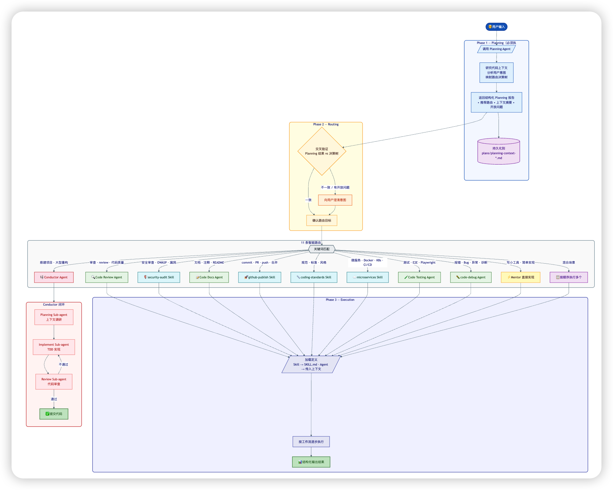

# Copilot Orchestra Demo

基于 GitHub Copilot 自定义 Agent 和 Skill 构建的**多 Agent 编排系统**演示项目。

以 `new-employee-mentor`（新员工导师）为主入口，通过 **Planning → Routing → Execution** 三阶段工作流，将用户请求智能路由到最合适的 Agent 或 Skill 完成任务。

## 架构概览



```
用户输入
  │
  ▼
┌─────────────────────────────┐
│  new-employee-mentor (入口)  │
│  Planning → Routing → Exec  │
└──────────┬──────────────────┘
           │ 11 条智能路由
           ▼
┌──────────────────────────────────────────┐
│  5 Agent          │  6 Skill             │
│  ─────────        │  ──────────          │
│  code-review      │  coding-standards    │
│  code-testing     │  github-publish      │
│  code-docs        │  microservices       │
│  code-debug       │  security-audit      │
│  Conductor        │  playwright-testing  │
│                   │  feishu-docs         │
└──────────────────────────────────────────┘
           │
           ▼ (Conductor 路由)
┌─────────────────────────────┐
│  Conductor 闭环子系统        │
│  planning-subagent           │
│  implement-subagent          │
│  code-review-subagent        │
└─────────────────────────────┘
```

## 三阶段工作流

| 阶段 | 说明 |
|------|------|
| **Phase 1: Planning** | 每次请求强制调用 `planning` Agent，研究代码上下文、分析意图、推荐路由 |
| **Phase 2: Routing** | 将 Planning 结果与 11 条决策树交叉验证，确认路由目标 |
| **Phase 3: Execution** | 加载 Skill/Agent 定义并按工作流执行，输出结构化结果 |

## Agent 列表

| Agent | 用途 |
|-------|------|
| `new-employee-mentor` | 主入口，智能路由分发 |
| `planning` | 上下文研究、意图分析、路由推荐 |
| `code-review` | 代码审查 + 安全检查 + 质量评估 |
| `code-testing` | 单元 / 集成 / UI / E2E 测试生成与执行 |
| `code-docs` | 文档 / 注释 / README 生成，支持同步飞书 |
| `code-debug` | 错误诊断：截图分析 → 知识库查询 → 代码定位 → 修复 |
| `Conductor` | 多阶段闭环编排（Planning → Implement → Review） |
| `pr-review-submit` | 将审查结果自动写入 GitHub PR |

## Skill 列表

| Skill | 用途 |
|-------|------|
| `coding-standards` | 全栈编码规范（TypeScript / React / Python / Go） |
| `github-publish` | 代码提交、创建 PR、指定审查者、合并代码 |
| `microservices` | 微服务架构设计、容器化部署、K8s、CI/CD |
| `security-audit` | OWASP Top 10 安全审计、漏洞扫描、依赖安全检查 |
| `playwright-testing` | Playwright UI/E2E 自动化测试 |
| `feishu-docs` | 飞书文档 / 知识库 / 电子表格操作 |
| `code-review` | 代码审查清单（🔴MUST / 🟡SHOULD / 🟢NIT 三级） |

## 11 条智能路由

| # | 关键词 | 目标 |
|---|--------|------|
| 1 | 审查 · review · 代码质量 | Code Review Agent |
| 2 | 安全审查 · OWASP · 漏洞 | security-audit Skill |
| 3 | 文档 · 注释 · README | Code Docs Agent |
| 4 | commit · PR · push · 合并 | github-publish Skill |
| 5 | 规范 · 标准 · 风格 | coding-standards Skill |
| 6 | 微服务 · Docker · K8s | microservices Skill |
| 7 | 测试 · E2E · Playwright | Code Testing Agent |
| 8 | 报错 · Bug · 异常 · 诊断 | code-debug Agent |
| 9 | 搭建项目 · 大型重构 | Conductor Agent |
| 10 | 写小工具 · 简单实现 | Mentor 直接实现 |
| 11 | 混合场景 | 按顺序执行多个 |

## 目录结构

```
.github/agents/           # Agent 定义
  new-employee-mentor.agent.md   # 主入口
  planning.agent.md              # 规划 Agent
  code-review.agent.md           # 代码审查
  code-testing.agent.md          # 代码测试
  code-docs.agent.md             # 代码文档
  code-debug.agent.md            # 错误诊断
  Conductor.agent.md             # 多阶段编排
  pr-review-submit.agent.md      # PR 审查提交
  planning-subagent.agent.md     # Conductor 调研子 Agent
  implement-subagent.agent.md    # Conductor 实现子 Agent
  code-review-subagent.agent.md  # Conductor 审查子 Agent

.claude/skills/           # Skill 定义
  coding-standards/       # 编码规范
  github-publish/         # GitHub 发布
  microservices/          # 微服务
  security-audit/         # 安全审计
  playwright-testing/     # Playwright 测试
  feishu-docs/            # 飞书文档
  code-review/            # 代码审查清单
```

## 使用方式

在 VS Code 中通过 GitHub Copilot Chat 调用：

```
@new-employee-mentor 审查当前代码的安全风险
@new-employee-mentor 为 snake-game.html 生成单元测试
@new-employee-mentor 提交代码并创建 PR
@new-employee-mentor 查询前端编码规范
```

## License

MIT
