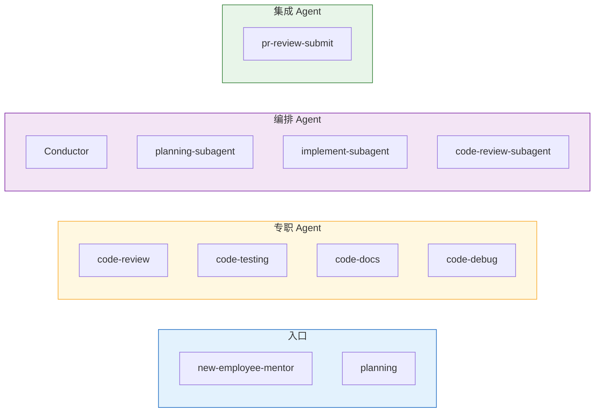
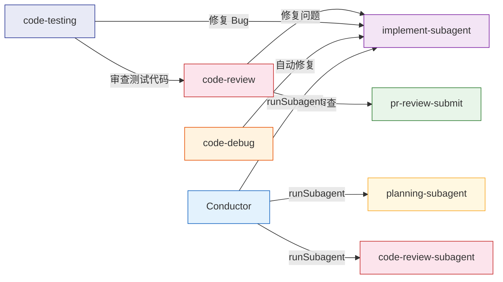
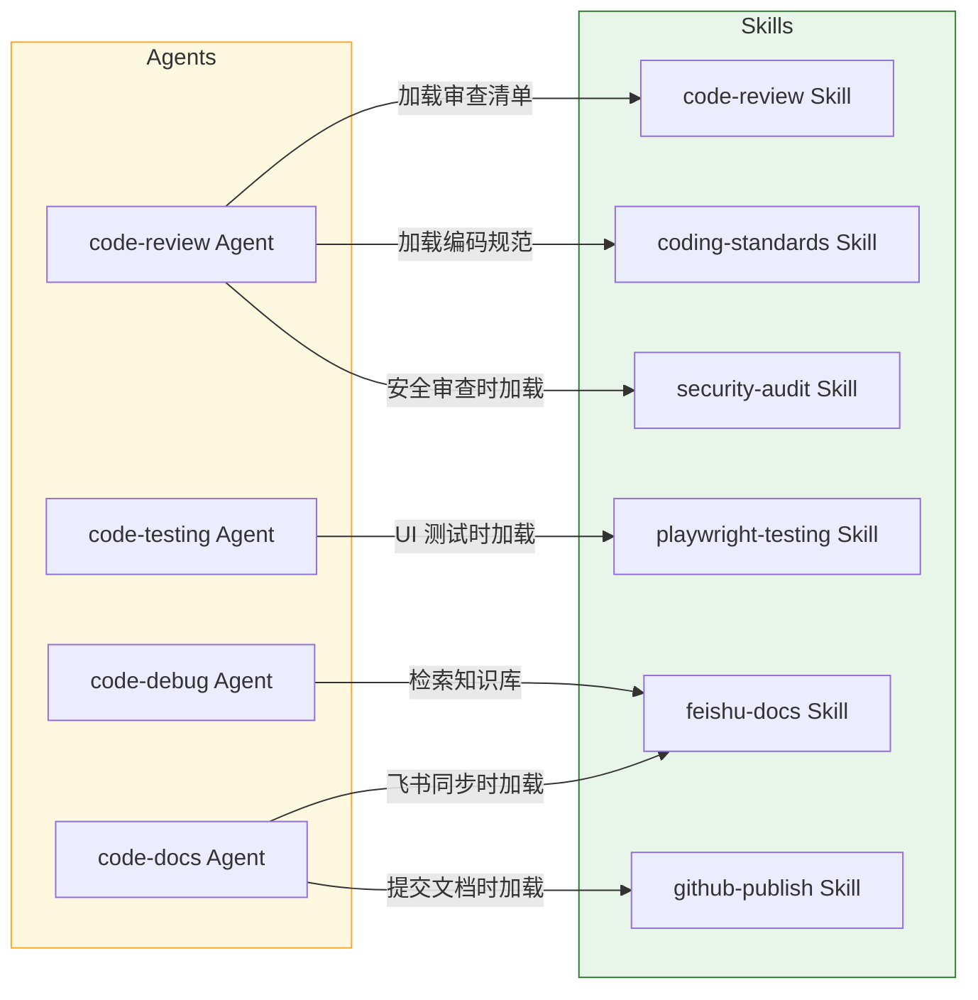
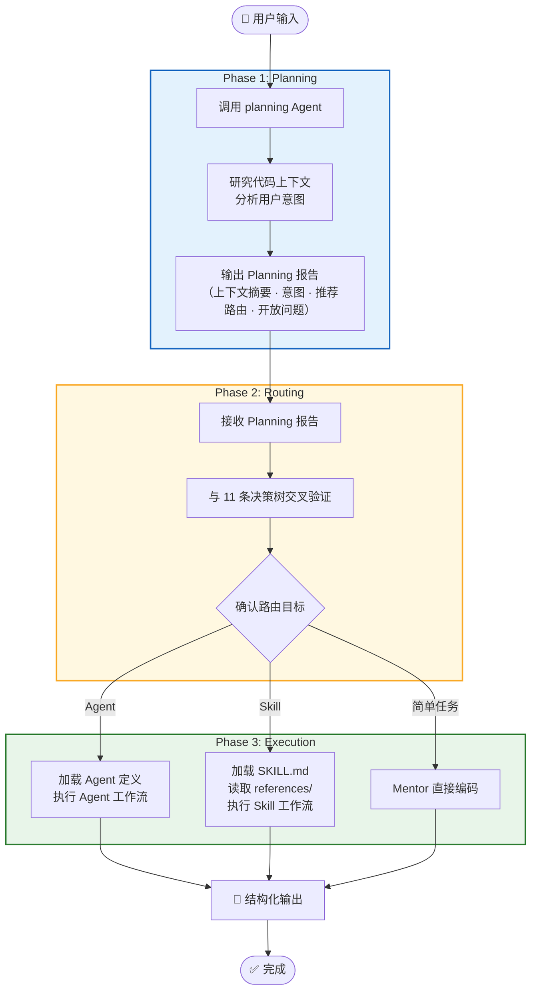
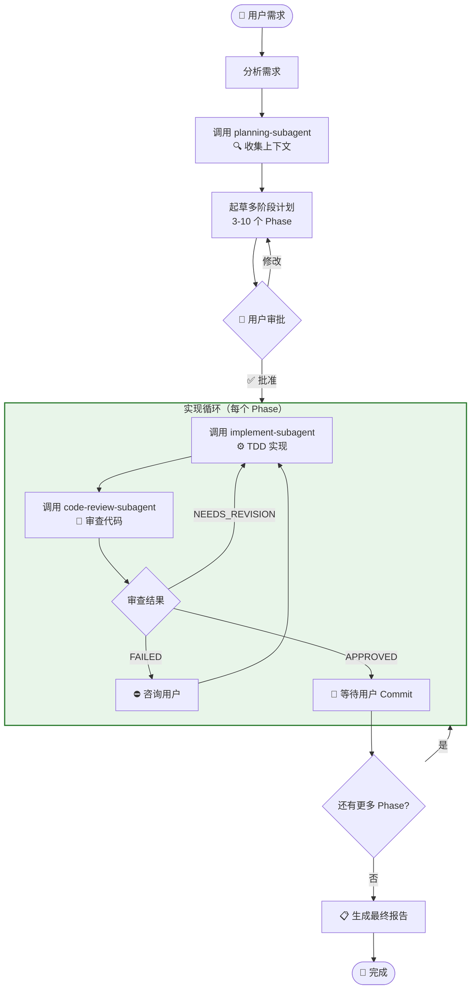
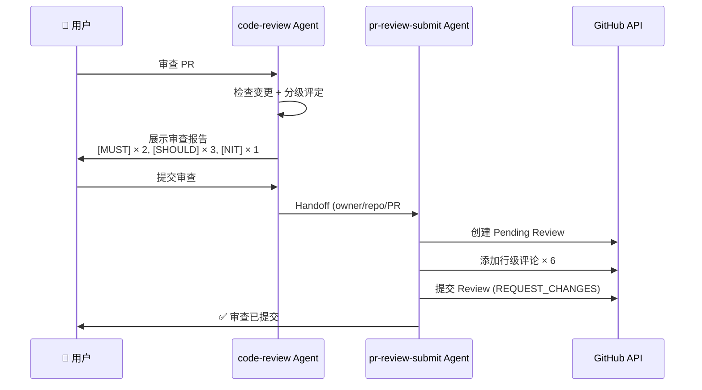
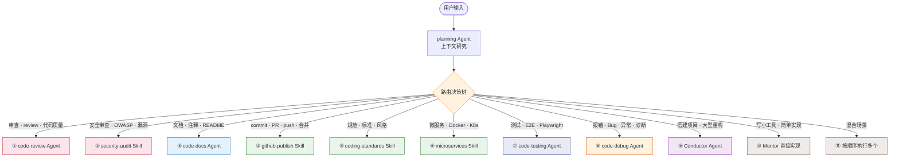

# 系统架构文档

> Copilot Orchestra Demo — 基于 GitHub Copilot Custom Agent + Custom Skill 的多 Agent 编排系统

## 1. 系统概述

### 1.1 项目目标

本项目演示如何利用 GitHub Copilot 的 **Custom Agent**（`.agent.md`）和 **Custom Skill**（`SKILL.md`）机制，构建一个多层级、可组合的智能开发辅助系统。系统以 `new-employee-mentor`（新员工导师）作为统一入口，通过 **Planning → Routing → Execution** 三阶段工作流，将用户请求智能路由到最合适的 Agent 或 Skill 完成任务。

### 1.2 核心理念

| 理念 | 说明 |
|------|------|
| **单一入口，智能分发** | 用户无需记忆每个 Agent/Skill 的名称和用途，`new-employee-mentor` 会自动分析意图并路由 |
| **规划先行** | 每次请求强制调用 `planning` Agent 做上下文研究，避免盲目执行 |
| **关注点分离** | 每个 Agent/Skill 聚焦单一职责，通过组合实现复杂工作流 |
| **Handoff 协作** | Agent 之间通过 `handoffs` 字段声明转交关系，支持链式协作 |
| **闭环质量保证** | Conductor 子系统通过 Planning → Implement → Review 循环确保交付质量 |

---

## 2. 整体架构

### 2.1 架构总览图

```mermaid
graph TB
    User([👤 用户输入]) --> Mentor

    subgraph EntryLayer["🚪 入口层"]
        Mentor["new-employee-mentor<br/>主入口路由 Agent"]
    end

    Mentor -->|"Phase 1: 强制调用"| Planning["planning<br/>上下文研究 Agent"]
    Planning -->|"返回 Planning 报告"| Mentor

    Mentor -->|"Phase 2-3: 路由 & 执行"| AgentLayer
    Mentor -->|"Phase 2-3: 路由 & 执行"| SkillLayer
    Mentor -->|"简单任务: 直接实现"| DirectExec["Mentor 自行编码"]

    subgraph AgentLayer["🤖 Agent 层"]
        CR["code-review<br/>代码审查"]
        CT["code-testing<br/>代码测试"]
        CD["code-docs<br/>文档生成"]
        CDB["code-debug<br/>错误诊断"]
        Conductor["Conductor<br/>多阶段编排"]
    end

    subgraph SkillLayer["📚 Skill 层"]
        SK_CS["coding-standards<br/>编码规范"]
        SK_GP["github-publish<br/>GitHub 发布"]
        SK_MS["microservices<br/>微服务架构"]
        SK_SA["security-audit<br/>安全审计"]
        SK_PT["playwright-testing<br/>Playwright 测试"]
        SK_FD["feishu-docs<br/>飞书文档"]
    end

    CR -->|"Handoff: 提交审查"| PRS["pr-review-submit<br/>PR 审查提交"]
    CR -->|"Handoff: 修复问题"| ImplSub

    subgraph ConductorSub["🎵 Conductor 子系统"]
        PlanSub["planning-subagent<br/>Claude Sonnet 4.5"]
        ImplSub["implement-subagent<br/>GPT-5.2-Codex"]
        ReviewSub["code-review-subagent<br/>Claude Sonnet 4.5"]
    end

    Conductor -->|"研究上下文"| PlanSub
    Conductor -->|"执行实现"| ImplSub
    Conductor -->|"代码审查"| ReviewSub

    CT -->|"Handoff: 修复 Bug"| ImplSub
    CT -->|"Handoff: 审查测试"| CR
    CDB -->|"Handoff: 自动修复"| ImplSub
    CDB -.->|"检索知识库"| SK_FD
    CT -.->|"UI 测试"| SK_PT

    style EntryLayer fill:#e3f2fd,stroke:#1565c0,stroke-width:2px
    style AgentLayer fill:#fff8e1,stroke:#f9a825,stroke-width:2px
    style SkillLayer fill:#e8f5e9,stroke:#2e7d32,stroke-width:2px
    style ConductorSub fill:#f3e5f5,stroke:#7b1fa2,stroke-width:2px
    style User fill:#e1f5fe,stroke:#0288d1
    style DirectExec fill:#efebe9,stroke:#795548
```



### 2.2 分层说明

| 层级 | 组件 | 职责 |
|------|------|------|
| **入口层** | `new-employee-mentor` | 接收用户请求，调用 Planning，路由到目标 Agent/Skill |
| **Agent 层** | 5 个专职 Agent + 1 个 PR 提交 Agent | 复杂任务处理，具备独立工作流和工具权限 |
| **Skill 层** | 7 个 Skill | 提供领域知识和规范指引，被 Agent 按需加载 |
| **Conductor 子系统** | 3 个子 Agent | 大型任务的闭环编排（Planning → Implement → Review） |

---

## 3. Agent 层详解

### 3.1 Agent 总览

系统包含 **11 个 Agent**，按职能分为 4 类：



### 3.2 各 Agent 详细说明

#### `new-employee-mentor` — 主入口路由 Agent

| 属性 | 值 |
|------|-----|
| **文件** | `.github/agents/new-employee-mentor.agent.md` |
| **工具** | `read`, `edit`, `search`, `agent`, `execute`, `web`, `todo` |
| **可路由目标** | 所有 Agent 和 Skill（10 条路由 + 直接实现） |
| **职责** | 接收用户请求 → 调用 Planning → 路由决策 → 分发执行 |

三阶段工作流：
1. **Phase 1: Planning** — 强制调用 `planning` Agent 研究上下文
2. **Phase 2: Routing** — 将 Planning 报告与决策树交叉验证
3. **Phase 3: Execution** — 加载目标 Agent/Skill 并执行

#### `planning` — 上下文研究 Agent

| 属性 | 值 |
|------|-----|
| **文件** | `.github/agents/planning.agent.md` |
| **工具** | `search`, `read`, `problems`, `changes`, `testFailure`, `fetch`, `usages` |
| **输出** | 结构化 Planning 报告（上下文摘要、意图分析、推荐路由、开放问题） |

研究工作流：解析用户输入 → 代码库研究（语义搜索 → 文件阅读 → 符号搜索 → 依赖分析） → 意图分析与路由推荐。达到 90% 置信度即停止。

#### `code-review` — 代码审查 Agent

| 属性 | 值 |
|------|-----|
| **文件** | `.github/agents/code-review.agent.md` |
| **工具** | `search`, `usages`, `problems`, `changes`, `read`, `agent` |
| **Handoff** | → `pr-review-submit`（提交审查）、→ `implement-subagent`（修复问题） |
| **关联 Skill** | `code-review`、`coding-standards`、`security-audit` |

审查流程：理解变更上下文 → 检查代码（`changes` + `search` + `usages`） → 分级评定（`[MUST]` / `[SHOULD]` / `[NIT]`） → 确定状态（`APPROVED` / `NEEDS_REVISION` / `REJECTED`） → 用户选择"提交审查"或"帮我修复"。

#### `code-testing` — 代码测试 Agent

| 属性 | 值 |
|------|-----|
| **文件** | `.github/agents/code-testing.agent.md` |
| **工具** | `read`, `edit`, `search`, `execute`, `problems`, `changes`, `playwright`, `agent` |
| **Handoff** | → `implement-subagent`（修复测试发现的 Bug）、→ `code-review`（审查测试代码） |
| **测试类型** | 单元测试（Vitest）、集成测试、UI/E2E 测试（Playwright） |

工作流：分析测试目标 → 检测测试框架 → 生成测试用例（TDD） → 执行并迭代。UI 测试使用 Playwright MCP 工具进行浏览器自动化。

#### `code-docs` — 文档生成 Agent

| 属性 | 值 |
|------|-----|
| **文件** | `.github/agents/code-docs.agent.md` |
| **工具** | `read`, `edit`, `search`, `execute`, `web` |
| **关联 Skill** | `feishu-docs`（飞书同步）、`github-publish`（提交文档） |

支持生成：代码注释、README、API 文档、架构文档。可按需同步到飞书或提交到 GitHub。

#### `code-debug` — 错误诊断 Agent

| 属性 | 值 |
|------|-----|
| **文件** | `.github/agents/code-debug.agent.md` |
| **工具** | `read`, `edit`, `search`, `agent`, `web`, `todo` |
| **Handoff** | → `implement-subagent`（自动修复） |
| **关联 Skill** | `feishu-docs`（知识库检索） |

诊断流程：分析错误信息（文字/图片） → 生成错误描述 → 检索飞书知识库（已知问题?） → 代码库定位 → 生成修复方案。

#### `Conductor` — 多阶段编排 Agent

| 属性 | 值 |
|------|-----|
| **文件** | `.github/agents/Conductor.agent.md` |
| **模型** | Claude Opus 4.5 |
| **工具** | `runCommands`, `runTasks`, `edit`, `search`, `todos`, `runSubagent`, `usages`, `problems`, `changes`, `testFailure`, `fetch`, `githubRepo` |
| **子 Agent** | `planning-subagent`, `implement-subagent`, `code-review-subagent` |

编排闭环详见 [Conductor 工作流文档](conductor-workflow.md)。

#### `pr-review-submit` — PR 审查提交 Agent

| 属性 | 值 |
|------|-----|
| **文件** | `.github/agents/pr-review-submit.agent.md` |
| **工具** | `read`, `search`, `changes` |
| **输入** | `owner/repo/pullNumber` + 审查结论 + 逐条 findings |
| **输出** | GitHub PR 行级评论 + Review 提交（`APPROVE` / `REQUEST_CHANGES` / `COMMENT`） |

#### Conductor 子 Agent

| 子 Agent | 模型 | 文件 | 职责 |
|----------|------|------|------|
| `planning-subagent` | Claude Sonnet 4.5 | `.github/agents/planning-subagent.agent.md` | 研究代码库上下文，收集相关文件/函数/模式 |
| `implement-subagent` | GPT-5.2-Codex | `.github/agents/implement-subagent.agent.md` | 按 TDD 流程执行实现（测试先行 → 编码 → 验证） |
| `code-review-subagent` | Claude Sonnet 4.5 | `.github/agents/code-review-subagent.agent.md` | 审查实现质量，输出 `APPROVED` / `NEEDS_REVISION` / `FAILED` |

> 注：`implement-subagent` 同时被 `code-review`、`code-testing`、`code-debug` 三个 Agent 通过 Handoff 复用。

### 3.3 Handoff 关系图



---

## 4. Skill 层详解

### 4.1 Skill 总览

系统包含 **7 个 Skill**，每个 Skill 由 `SKILL.md` 定义，包含工作流、触发条件和 `references/` 参考文件。

| Skill | 路径 | 用途 | 触发关键词 |
|-------|------|------|-----------|
| `coding-standards` | `.claude/skills/coding-standards/` | 全栈编码规范（TS/React/Python/Go） | 规范、标准、命名、风格、最佳实践 |
| `github-publish` | `.claude/skills/github-publish/` | 代码提交、创建 PR、指定审查者 | 提交、commit、push、PR、merge、发布 |
| `microservices` | `.claude/skills/microservices/` | 微服务架构设计、容器化部署 | 微服务、Docker、K8s、CI/CD、熔断 |
| `security-audit` | `.claude/skills/security-audit/` | OWASP Top 10 安全审计 | 安全审查、OWASP、漏洞扫描、安全加固 |
| `playwright-testing` | `.claude/skills/playwright-testing/` | Playwright UI/E2E 自动化测试 | Playwright、UI 测试、E2E、页面测试 |
| `feishu-docs` | `.claude/skills/feishu-docs/` | 飞书文档/知识库/电子表格操作 | 飞书、Feishu、Lark、知识库 |
| `code-review` | `.claude/skills/code-review/` | 代码审查清单（三级严重度） | 审查、review、代码质量 |

### 4.2 Skill 与 Agent 的关联



### 4.3 Skill 结构约定

每个 Skill 目录结构：

```
.claude/skills/<skill-name>/
├── SKILL.md              # Skill 定义：触发条件、工作流、输出格式
└── references/           # 参考文档（规范、清单、模板等）
    ├── general.md
    ├── frontend.md
    └── ...
```

- `SKILL.md` 通过 `description` 字段声明触发条件
- Agent 通过 `read_file` 加载 `SKILL.md` 获取工作流
- `references/` 存放详细的参考文档，按 `SKILL.md` 指引按需加载

---

## 5. 核心工作流

### 5.1 new-employee-mentor 三阶段工作流



详见 [new-employee-mentor 工作流文档](new-employee-mentor-workflow.md)。

### 5.2 Conductor 闭环工作流



Conductor 有 3 个强制暂停点：① 计划审批 ② 每 Phase 完成后等待 Commit ③ 整体完成。

详见 [Conductor 工作流文档](conductor-workflow.md)。

### 5.3 Handoff 机制：code-review → PR Review Submit



---

## 6. 路由决策树

`new-employee-mentor` 根据 Planning 报告和关键词匹配，将请求路由到 11 个目标：



### 路由规则表

| # | 关键词 | 目标 | 类型 |
|---|--------|------|------|
| 1 | 审查、review、检查代码、代码质量 | `code-review` Agent | Agent |
| 2 | 安全审查、OWASP、漏洞扫描、安全加固 | `security-audit` Skill | Skill |
| 3 | 文档、注释、README、API 文档 | `code-docs` Agent | Agent |
| 4 | 提交、commit、push、PR、merge、发布 | `github-publish` Skill | Skill |
| 5 | 规范、标准、命名、风格、最佳实践 | `coding-standards` Skill | Skill |
| 6 | 微服务、Docker、K8s、CI/CD、熔断 | `microservices` Skill | Skill |
| 7 | 测试、单元测试、E2E、Playwright | `code-testing` Agent | Agent |
| 8 | 报错、错误、Bug、异常、诊断 | `code-debug` Agent | Agent |
| 9 | 搭建项目、大型重构、从零开始 | `Conductor` Agent | Agent |
| 10 | 写小工具、简单实现、生成页面 | Mentor 直接实现 | 直接 |
| 11 | 混合场景（如"提交并审查"） | 按顺序执行多个 | 组合 |

---

## 7. 技术栈

### 7.1 Agent/Skill 框架

| 组件 | 技术 |
|------|------|
| Agent 定义 | GitHub Copilot Custom Agent（`.agent.md`，YAML frontmatter） |
| Skill 定义 | GitHub Copilot Custom Skill（`SKILL.md` + `references/`） |
| Agent 调用 | VS Code GitHub Copilot Chat（`@agent-name`） |
| 子 Agent 编排 | `#runSubagent` 工具 |
| Handoff 机制 | YAML `handoffs` 字段声明 Agent 间转交 |

### 7.2 AI 模型

| Agent | 模型 |
|-------|------|
| `Conductor` | Claude Opus 4.5 |
| `planning-subagent` | Claude Sonnet 4.5 |
| `code-review-subagent` | Claude Sonnet 4.5 |
| `implement-subagent` | GPT-5.2-Codex |
| 其他 Agent | 默认模型（由 GitHub Copilot 分配） |

### 7.3 示例项目与测试

| 组件 | 技术 |
|------|------|
| 示例项目 | 贪吃蛇游戏（`workspace/snake-game-logic.js`） |
| 单元测试 | Vitest |
| UI/E2E 测试 | Playwright |
| 演示幻灯片 | HTML（`workspace/slides/`） |
| PPTX 生成 | `workspace/generate-pptx.js` |

### 7.4 外部集成

| 集成 | 工具 |
|------|------|
| GitHub PR 操作 | GitHub MCP Server |
| 飞书文档/知识库 | 飞书 MCP Server |
| 浏览器自动化 | Playwright MCP Server |

---

## 8. 文件结构

```
Copilot-orchestra-demo/
├── .github/agents/                    # Agent 定义文件
│   ├── new-employee-mentor.agent.md   # 主入口路由 Agent
│   ├── planning.agent.md             # 上下文研究 Agent
│   ├── code-review.agent.md          # 代码审查 Agent
│   ├── code-testing.agent.md         # 代码测试 Agent
│   ├── code-docs.agent.md            # 文档生成 Agent
│   ├── code-debug.agent.md           # 错误诊断 Agent
│   ├── Conductor.agent.md            # 多阶段编排 Agent
│   ├── pr-review-submit.agent.md     # PR 审查提交 Agent
│   ├── planning-subagent.agent.md    # Conductor 调研子 Agent
│   ├── implement-subagent.agent.md   # Conductor 实现子 Agent
│   └── code-review-subagent.agent.md # Conductor 审查子 Agent
│
├── .claude/skills/                    # Skill 定义文件
│   ├── coding-standards/             # 编码规范
│   ├── github-publish/               # GitHub 发布
│   ├── microservices/                # 微服务架构
│   ├── security-audit/               # 安全审计
│   ├── playwright-testing/           # Playwright 测试
│   ├── feishu-docs/                  # 飞书文档
│   └── code-review/                  # 代码审查清单
│
├── docs/                             # 项目文档
│   ├── architecture.md               # 架构文档（本文件）
│   ├── conductor-workflow.md         # Conductor 工作流详解
│   └── new-employee-mentor-workflow.md # Mentor 工作流详解
│
├── workspace/                        # 示例项目
│   ├── snake-game-logic.js           # 贪吃蛇游戏逻辑
│   ├── snake-game.html               # 贪吃蛇游戏 UI
│   ├── vitest.config.js              # Vitest 配置
│   ├── generate-pptx.js              # PPTX 生成脚本
│   └── slides/                       # 演示幻灯片
│
├── tests/                            # 测试文件
│   ├── playwright.config.ts          # Playwright 配置
│   ├── unit/                         # 单元测试
│   ├── e2e/                          # E2E 测试
│   ├── ui/                           # UI 测试
│   └── visual/                       # 视觉回归测试
│
├── plans/                            # Conductor 生成的计划文件
└── README.md                         # 项目说明
```
