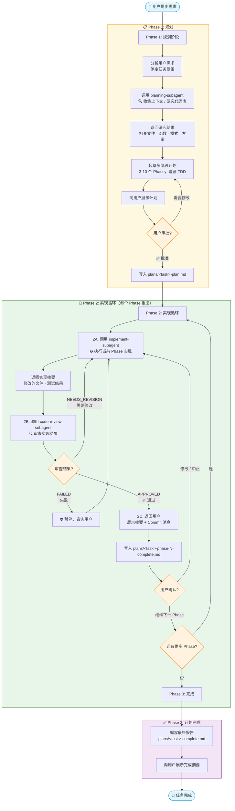
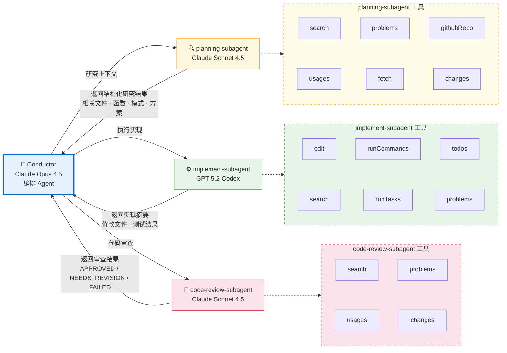
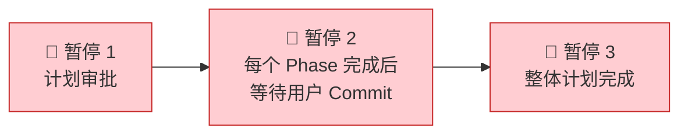

# Conductor Agent 工作流程

## 概述

`Conductor` 是一个编排型 Agent，负责管理完整的开发生命周期：**规划 → 实现 → 审查 → 提交**。它不直接编写代码，而是通过调用 3 个子 Agent（subagent）分工协作完成复杂任务。

## 整体流程图

## 子 Agent 调用关系图

## 强制暂停点（Mandatory Stops）

Conductor 在以下时刻必须暂停等待用户确认：

1. **计划审批** — 展示计划后等待用户批准或修改
2. **Phase 提交** — 每个 Phase 审查通过后，等待用户 Git Commit 并确认继续
3. **计划完成** — 最终报告生成后通知用户

## 子 Agent 职责对比

| 子 Agent | 模型 | 职责 | 输出 |
| -------- | ---- | ---- | ---- |
| **planning-subagent** | Claude Sonnet 4.5 | 研究代码库上下文，收集相关文件/函数/模式 | 结构化研究结果 |
| **implement-subagent** | GPT-5.2-Codex | 按 TDD 流程执行实现（测试先行 → 编码 → 验证） | 实现摘要 + 测试结果 |
| **code-review-subagent** | Claude Sonnet 4.5 | 审查实现质量，验证测试覆盖和最佳实践 | APPROVED / NEEDS_REVISION / FAILED |

## 产出文件

| 阶段 | 文件 | 说明 |
| ---- | ---- | ---- |
| 计划 | `plans/<task>-plan.md` | 多阶段实现计划 |
| 每 Phase 完成 | `plans/<task>-phase-<N>-complete.md` | Phase 完成报告 + Commit 消息 |
| 整体完成 | `plans/<task>-complete.md` | 最终总结报告 |
