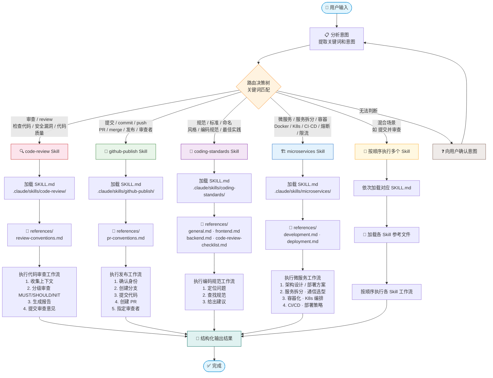

# new-employee-project Agent 工作流程

## 概述

`new-employee-project` 是一个新员工项目路由 Agent，负责分析用户输入并智能分发到 4 个 Skill 执行任务。

## 工作流程图

## Skill 路由表

| Skill | 路径 | 触发关键词 | 参考文件 |
| ----- | ---- | ---------- | -------- |
| **code-review** | `.claude/skills/code-review/` | 审查、review、检查代码、安全漏洞、代码质量 | `review-conventions.md` |
| **github-publish** | `.claude/skills/github-publish/` | 提交、commit、push、PR、merge、发布、审查者 | `pr-conventions.md` |
| **coding-standards** | `.claude/skills/coding-standards/` | 规范、标准、命名、风格、编码规范、最佳实践 | `general.md`、`frontend.md`、`backend.md`、`code-review-checklist.md` |
| **microservices** | `.claude/skills/microservices/` | 微服务、服务拆分、Docker、K8s、CI/CD、熔断、限流 | `development.md`、`deployment.md` |

## 执行流程

1. **分析意图** — 阅读用户输入，提取关键词和意图
2. **加载 Skill** — 读取匹配 Skill 的 `SKILL.md` 获取详细工作流
3. **加载参考文件** — 按 `SKILL.md` 指引加载 `references/` 下的规范文件
4. **执行任务** — 按 Skill 定义的工作流逐步完成
5. **反馈结果** — 以结构化格式输出结果
